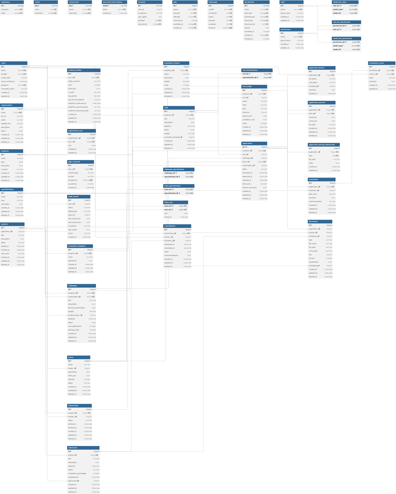

<div align="center">

# NTI Backend
### Nitriansky technologický inkubátor

REST API backend for the NTI platform — a process and registration system for managing programs, applications, projects, mentoring, and evaluation.

🤖 [Backend Repository](https://github.com/Bruskych/BE_NTI) · 🎨 [Frontend Repository](https://github.com/Bruskych/FE_NTI)


</div>

---

### Tech Stack & Tools
* **Core:** Laravel 13 & PHP 8.4
* **Database & Caching:** MySQL 8, Redis
* **Dev Environment:** Docker Compose, Mailpit (SMTP Testing)
* **Auth & Security:** Secure token authentication via Laravel Sanctum and middleware-enforced RBAC using Spatie.
* **Documentation:** OpenAPI / Swagger (L5-Swagger)

---

### 📥 1. Quick Start

```Clones the repository``` with the backend code from GitHub to your local computer.
```bash
git clone <repository-url>
```

You need to go inside the ```project folder```
```bash
cd BE_NTI
```

Creates a copy ````(.env)```` of the template file .env.example
```bash
cp .env.example .env
```

---

### 🐳 2. Start Containers

Since Composer dependencies are baked into the Dockerfile, the initial build might take a few minutes. Run the following command to build and start all microservices in the background:

```bash
docker compose up -d --build
```

---

### 🔐 3. Generate Application Key

Once the containers are running, generate a unique encryption key for your Laravel application. This key is used to securely encrypt user sessions, cookies, and tokens. Without it, the app will throw a 500 error.

```bash
php artisan key:generate
```
```OR```
```bash
docker compose exec app php artisan key:generate
```

---

### 📄 4. Run Migrations and Seeders

Set up the database structure and populate it with initial data, roles, and administrative accounts:

```bash
docker compose exec app php artisan migrate --seed
```

---

### ⚙️ Service Architecture & Ports

All services running inside the Docker network are pre-configured. You can access them via the following local URLs:

| Service | 🌐 Context / UI URL                     | Internal Port | External Port |
|---|-----------------------------------------|---|---|
| API Endpoint | http://localhost:8000/api               | — | 8000 |
| Swagger UI | http://localhost:8000/api/documentation | — | 8000 |
| phpMyAdmin | http://localhost:8080                   | 80 | 8080 |
| Mailpit (Email Hub) | http://localhost:8025                   | 8025 | 8025 |

### ⚙️ Background Processing & Automation

Thanks to the dedicated infrastructure containers, you don't need to configure host crontabs or run manual processing commands.

* **Asynchronous Queues (`nti-queue`):** Processes emails, notifications, and heavy background tasks automatically.
* **Task Scheduler (`nti-scheduler`):** Automatically runs Laravel's internal loop (`schedule:work`) every minute to trigger deadline reminders and maintenance tasks.

To manually trigger the deadline reminders immediately for debugging, run:

```bash
docker compose exec app php artisan notifications:deadline-reminders --days=3
```

---

### 🧪 Running Tests

Execute the comprehensive test suite (Unit, Integration, and Security test coverage for XSS, SQL injection, and rate limiting) directly inside the containerized environment:

```bash
docker compose exec app php artisan test
```

---

## 📦 API Documentation (Swagger)

Swagger UI is available at http://localhost:8000/api/documentation after starting the server.

If you modify annotations in Controllers or DTOs, regenerate the OpenAPI specification file using the following command:

```bash
docker compose exec app php artisan l5-swagger:generate
```

---

## Features

### Authentication & Accounts
- Email registration with OTP verification and password reset
- 9 RBAC roles: `visitor`, `student`, `team_leader`, `company`, `mentor`, `evaluator`, `content_editor`, `admin`, `super_admin`
- Sanctum Bearer token authentication
- Student onboarding profile (study program, year, skills, GPA)

### Organizations & Teams
- Company organization management with member roles (owner / manager / member)
- Student team creation, invitations, and membership management

### Programs & Calls
- Configurable programs (A — grant incubation, B — live practice)
- Calls with open/close lifecycle management
- Configurable form fields per program and call

### Applications
- Full application lifecycle: draft → submitted → in review → approved / rejected
- 11-status state machine with history and audit trail
- Required field validation before submission
- Program B pairing submissions (CV, motivation letter, solution proposal)

### Evaluation & Decisions
- Evaluation templates with scoring criteria
- Committee scoring and approval/rejection workflow
- Automatic average score calculation on decision

### Projects & Milestones
- Project management linked to approved applications
- Milestone tracking with approval and deadline monitoring
- Daily deadline reminders via scheduled artisan command

### Mentorship & Consultations
- Mentor assignment to projects with email notification
- Consultation records with scheduling

### Documents
- Versioned document uploads with classification (public / internal / confidential)
- MIME type validation (magic bytes check) — PDF, DOC, DOCX, JPG, PNG
- Document access codes, preview, and download
- Template-based document generation (internship agreements)

### Notifications
- In-app notification center (accept/reject/read/delete)
- Transactional emails: registration, application submitted, approved, rejected, mentor assigned
- Deadline reminder emails (3 days before milestone deadline)
- Admin-managed email templates with variable substitution
- Bulk messaging to user groups via queue

### CMS & Public Web
- Pages, posts (articles / FAQ / success stories), and partners CRUD
- SEO fields: `meta_title`, `meta_description`, `og_image`, `slug`
- Sitemap.xml endpoint
- Content filterable by type: `?type=faq`

### Admin & Reporting
- Admin dashboard with pending applications overview
- CSV / XLSX / PDF exports with audit log
- GDPR data export and erasure for any user
- Audit trail for all critical operations (approvals, role changes, exports, GDPR)

### Specializations (Program A)
- Qualification stacks 01–05 per spec
- Stack filter: `GET /api/specializations?stack=01`

---

## Project Structure

```
app/
├── Http/                    # TRANSPORT LAYER (Requests & Responses)
│   ├── Controllers/         # API Controllers (handle endpoints, delegate to Actions/Services)
│   ├── Requests/            # Incoming data validation (Form Requests for applications, programs)
│   ├── Resources/           # API Resource transformers (standardizing JSON output for Vue)
│   ├── Middleware/          # HTTP filters (Role-based access, security headers)
│   └── Concerns/            # Shared traits (e.g., HasApiResponse for unified API outputs)
│
├── Actions/                 # CORE BUSINESS LOGIC (Single-Responsibility Principle)
│   └── [Domain]/            # Atomic action classes (e.g., UpdateUserProfileAction)
│
├── Services/                # COMPLEX BUSINESS LOGIC (Coarse-Grained Services)
│   └── [Domain]/            # Heavy lifting services (PDF generation, Swagger integrations, third-party APIs)
│
├── Models/                  # DATA LAYER (Database Entities)
│   └── [Model].php          # Eloquent models (User, Program, Application, Project, Mentor)
│
├── Policies/                # ACCESS CONTROL (Fine-Grained Authorization)
│   └── [Model]Policy.php    # Resource authorization gates coupled with Spatie Permissions
│
├── Console/                 # AUTOMATION (Artisan CLI & Cron Tasks)
│   └── Commands/            # Custom Artisan commands (e.g., deadline & notification reminders)
│
├── Jobs/                    # ASYNC PROCESSING (Background Queues via Redis)
│   └── [Job].php            # Heavy async tasks (e.g., Excel report generation, bulk email dispatches)
│
├── Mail/                    # NOTIFICATIONS (Email Blueprints)
│   └── [Mailable].php       # Mail layout configurations captured locally by Mailpit
│
└── Providers/               # INFRASTRUCTURE (Bootstrapping Core System Services)
```

## Database structure in the project

```
database/
├── factories/                      # DATA GENERATORS (Testing & Development)
│   └── [Model]Factory.php          # Blueprints for generating realistic fake records (User, Application)
│
├── migrations/                     # SCHEMA DEFINITIONS (Database Version Control)
│   └── [Time]create[name]table.php # Table schemas (programs, applications, projects, permissions)
│
└── seeders/                        # DATA POPULATION (System Configuration & Mock State)
    ├── DatabaseSeeder.php          # Main entry point that orchestrates the seeding process
    ├── RolePermissionSeeder.php    # Initial configuration for Spatie roles & permissions (Admin, Student)
    └── [Domain]Seeder.php          # Dummy data injection for local development
```

## Testing Structure & Coverage

```
tests/
├── Feature/                          # INTEGRATION & API TESTS (End-to-End HTTP Workflows)
│   └── [Domain]Test.php              # Feature & endpoint validations (Auth, Application flows, RBAC security, Exports)
│
├── Unit/                             # ISOLATED UNIT TESTS (Core Business Logic & Models)
│   └── [Model/Service]Test.php       # Isolated assertions for Eloquent models, relations, and standalone services
│
└── TestCase.php                      # TESTING BASEMENT (Global Setup & Bootstrapping)
```

---

## 🗺️ Database Schema

<p align="center">
  <a href="https://dbdiagram.io/d/6a28a9ee25fc5bf036cf0a5b">
    
  </a>
  <br>
  <span>💡 <i>Click on the image to open the interactive schema and explore relationships.</i></span>
</p>

---

## 👨🏽‍💻 Authors

| Name | GitHub                                         |
|---|--------------------------------------------------|
| Vladyslav Svider | [Link to git](https://github.com/Versus1478)     |
| Vladyslav Shcherbyna | [Link to git](https://github.com/Bruskych)       |
| Davyd Shapovalov | [Link to git](https://github.com/davidshapovalov) |
